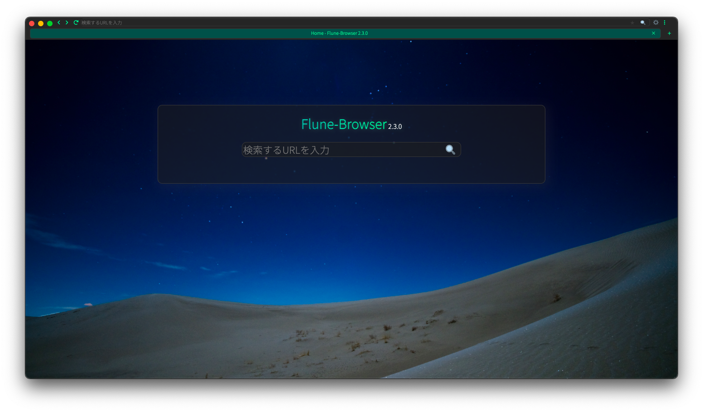

# Flune-Browser 2.4.0
Flune-Browser 2.3.0 Dev 2022.06.27.1のリリースを間違えて削除してしまいました。
申し訳ございません。

**2.1.0には重大なバグが含まれています。**

[Flune-Browser 2.2.0](https://github.com/mf-3d/flune-browser/releases/v2.2.0)以降(推奨: v2.3.0)をダウンロードしてください。

---

Flune-Browserが生まれ変わりました！

ダウンロードしてくださいな。

---

Flune-Browser 1.x.xは今後更新はされませんがサポートは続く予定です。

## 最新バージョン
|リリースチャネル |  Stable  |     Beta    |          Dev          |
|--------------|----------|-------------|-----------------------|
|   バージョン   |  v2.3.0  |v2.3.0 Beta 1|v2.3.0 Dev 2022.06.29.1|
|   リリース日   |2022/07/03| 2022/07/01  |      2022/06/29       |

## 使用を控える必要があるバージョン
- 2.1.0
- 2.1.1
- 2.1.2

---

普段はdevelopブランチで作業しています。

mainはいつでもリリースできるような状態(になる予定)です。
