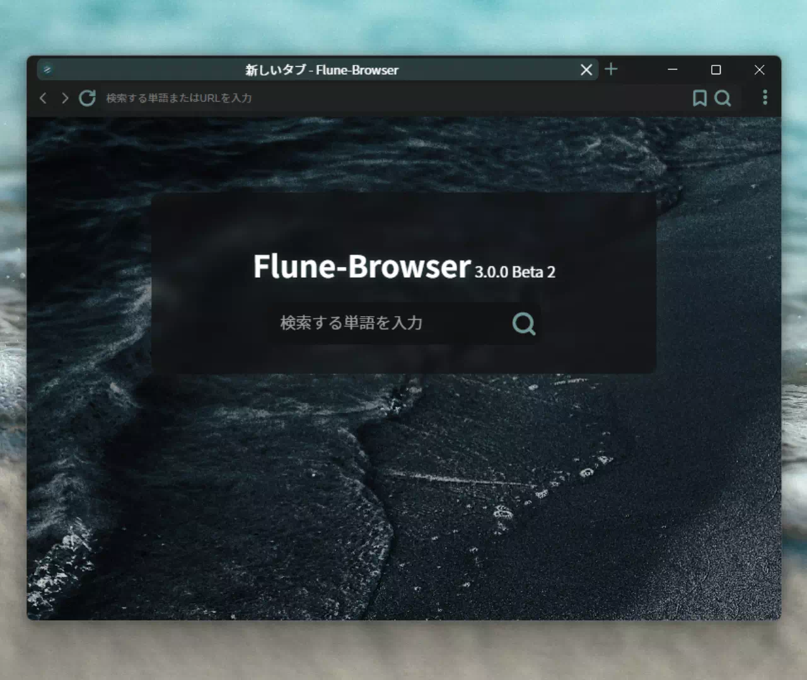

# 🌐 Flune-Browser 3.0.0

> [!WARNING]
> 紹介されている要素は最終リリース前に変更される可能性があります。

Flune-Browserが生まれ変わりました！

<!-- Flune-Browser 2.x系からの互換性があります。 -->
<!-- ## 必須環境
| バージョン        |       OS       |         OSバージョン          |   アーキテクチャ(macOS)    |
|-----------------|-----------------|-----------------------------|-------------------------|
|2.5.0 Beta 1 -   | macOS / Windows |macOS 10.11 - / Windows 10 - | Universal / Intel       |
|2.4.1 -          | macOS / Windows |macOS 10.11 - / Windows 10 - | Arm64 / Intel           |
|- 2.4.0          | macOS / Windows |macOS 10.11 - / Windows 10 - | Intel                   | -->

## 🔖 最新バージョン
|リリースチャネル |Stable|Beta|Dev|
|---------------|---|---|---|
|   バージョン   |2.5.1|3.0.0 Beta 2|3.0.0 Dev 2025.11.8.1|
|   リリース日   |2022/08/20|2025/12/13|2025/11/08|

## ℹ️ 関連
- [Flune-Optional-Pack](https://github.com/Mf-3d/Flune-Optional-Pack) — Flune-Browser v2.x系の拡張パック。
- [Flune-C](https://github.com/Mf-3d/Flune-C) — c.Monotの実質的な後継、[Monot](https://github.com/mncrp/monot)の派生。
- [c.Monot](https://github.com/Mf-3d/c.monot) — Monotの派生。
<!-- - [Runa-Browser](https://github.com/Mf-3d/Runa-Browser) — Flune-Browserの前身。
- [Lunowse](https://github.com/Mf-3d/lunowse) — Runa-Browserの後継。 -->